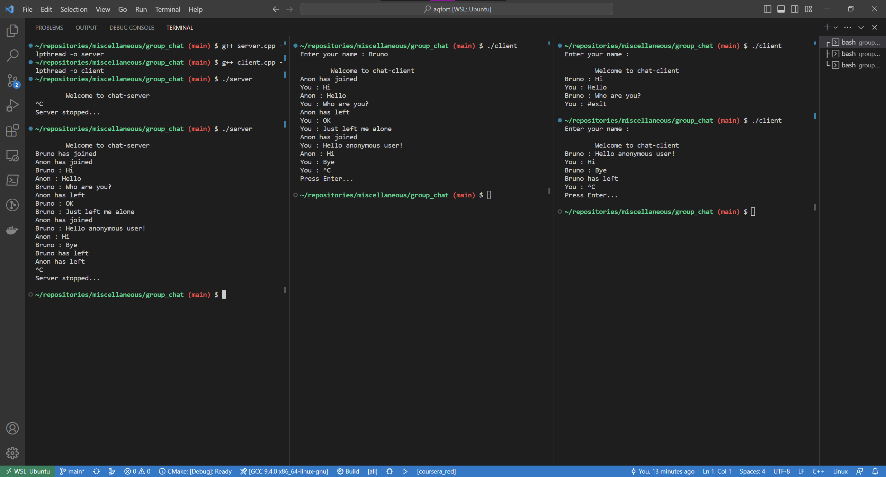

# Group Chat

## Chatting among multiple clients

> Raw

### Usage

1. Compile `server.cpp` and `client.cpp`

    ```Compile
    g++ server.cpp -lpthread -o server
    g++ client.cpp -lpthread -o client
    ```

2. Run `server`

    ```Server
    ./server
    ```

3. Run `client` (multiple times in different terminals)

    ```Client
    ./client
    ```

4. To exit `client` type `#exit` or press `Ctrl+C` then `Enter`

5. Lastly, shutdown `server` pressing `Ctrl+C`

### Screenshot


